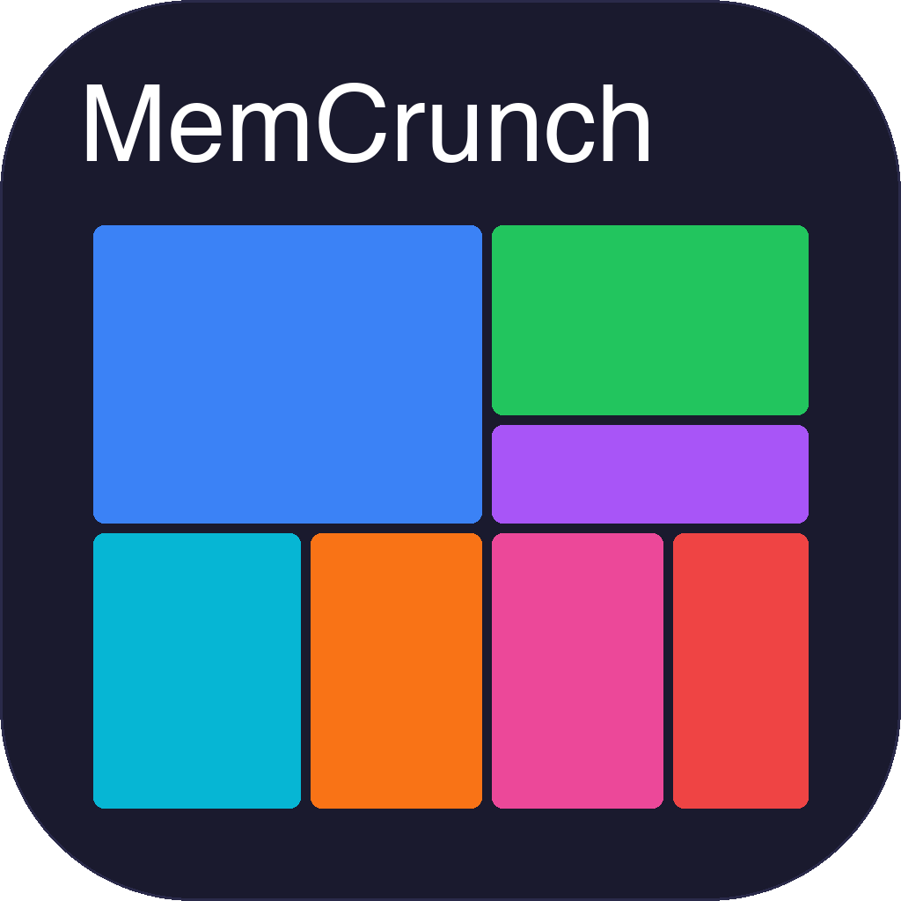

<p align="center">
  
</p>

<h1 align="center">MemCrunch</h1>

<p align="center">A fast, native macOS disk space analyzer. Think WinDirStat, but built with SwiftUI and a Rust-powered scanning engine.</p>

      

[](https://github.com/tanujdargan/memcrunch/releases/download/v0.1.0/MemCrunch-0.1.0.dmg)

## Features

- **Parallel scanning** — Rust core with [jwalk](https://github.com/Byron/jwalk) traverses directories across all CPU cores
- **Squarified treemap** — click any directory block to drill in, largest items get the largest rectangles
- **File type breakdown** — donut chart + extension table showing where your space goes
- **All drive types** — internal SSD, external USB, network shares (SMB/NFS/AFP)
- **APFS-aware** — correctly handles firmlinks, skips system sub-volumes, no double-counting
- **Physical disk usage** — reports actual allocated blocks, so sparse files (like Docker.raw) show real consumption
- **Native UI on every platform** — SwiftUI on macOS, WPF on Windows, GTK4 on Linux (coming soon)

## Architecture

One Rust core, native frontends per platform — no Electron, no web views.

```
┌────────────────┐  ┌──────────────┐  ┌──────────────┐
│  SwiftUI (mac) │  │  WPF (win)   │  │  GTK4 (linux)│
└───────┬────────┘  └──────┬───────┘  └──────┬───────┘
        │ C FFI            │ P/Invoke         │ Rust
┌───────▼──────────────────▼──────────────────▼───────┐
│              Rust Core (memcrunch-core/)             │
│              jwalk, indextree, treemap               │
└─────────────────────────────────────────────────────┘
```

The Rust core compiles to a static library. Swift calls it through a thin C FFI layer — complex data crosses the boundary as JSON strings. Zero code generation, fully debuggable.

## Building

**Requirements:** macOS 14.0+, Xcode 16+, Rust 1.80+, [xcodegen](https://github.com/yonaskolb/XcodeGen)

```bash
# Install dependencies
brew install xcodegen
rustup update

# Build Rust core
cd memcrunch-core
cargo build --release

# Generate Xcode project
cd ../MemCrunch
xcodegen generate

# Build the app
xcodebuild -project MemCrunch.xcodeproj -scheme MemCrunch -configuration Release build
```

Or just:
```bash
make all        # builds Rust + generates Xcode project
make swift      # builds everything including the app
```

## Installing from DMG

**[Download MemCrunch v0.1.0](https://github.com/tanujdargan/memcrunch/releases/download/v0.1.0/MemCrunch-0.1.0.dmg)** — open the DMG and drag MemCrunch to Applications.

> **Note:** The DMG is ad-hoc signed (not notarized). macOS Gatekeeper will show a warning on first launch. Right-click the app > **Open** to bypass this, or go to System Settings > Privacy & Security and click "Open Anyway."

## Full Disk Access

MemCrunch works without Full Disk Access, but some system directories will be skipped. For a complete scan, grant access in **System Settings > Privacy & Security > Full Disk Access**.

## Platform Support

| Platform | UI Framework | Status |
|----------|-------------|--------|
| macOS 14+ | SwiftUI | Available |
| Windows 10/11 | WPF (.NET 8) | Available |
| Linux | GTK4-rs | Coming soon |

## Coming Soon

- Native Linux app (GTK4-rs)
- Notarized macOS releases
- Delete files directly from the treemap
- Search and filter by file name or extension

## License

MIT
